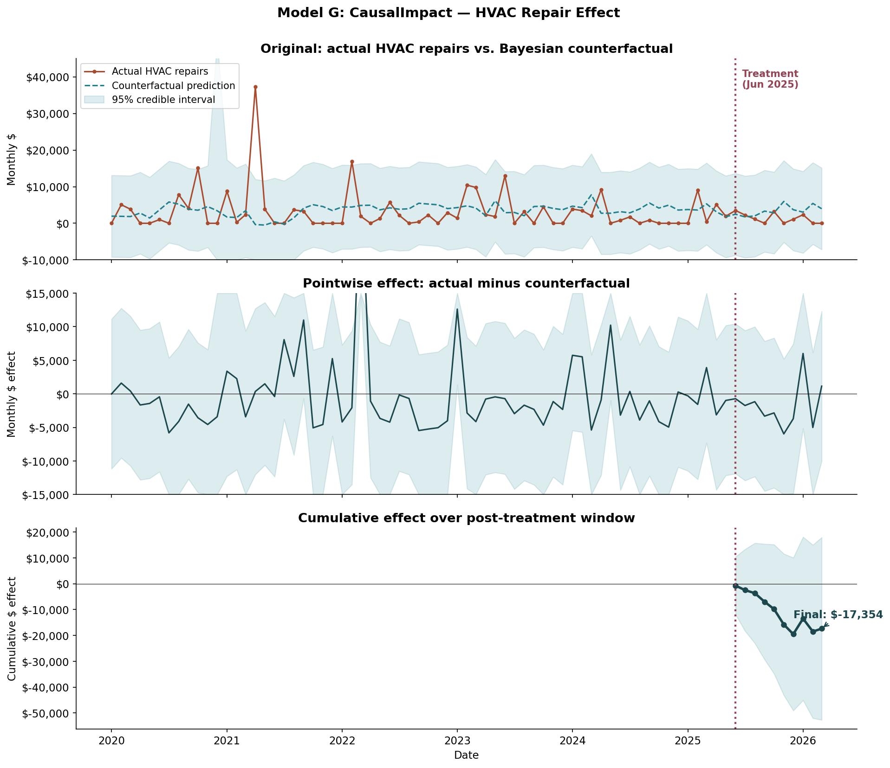

# Capital Investment ROI in Building Operations: A Multi-Method Causal Inference Study

> **Did spending $12,000 on a single HVAC compressor replacement actually reduce a building's reactive repair costs afterward — or were costs trending down anyway?**
>
> A real-world causal inference question, addressed with eight complementary statistical methods on 75 months of operational data.

---

## Key Finding

**The Welch's t-test estimates a $1,953/month reduction in reactive HVAC repair costs after the capital intervention (95% CI [-$3,634, -$271], p = 0.024) — statistically significant at α = 0.05.** Seven of eight model specifications produce negative point estimates ranging from -$1,044 to -$2,136/month. The synthetic control approach is marginally significant at p = 0.057. CausalImpact (Bayesian Structural Time Series) assigns approximately 87% posterior probability to a causal effect. At the headline estimate, a $12,000 capital cost recovers in roughly 6 months.



*Bayesian counterfactual prediction (CausalImpact). Top: actual vs. predicted HVAC repair series. Middle: pointwise treatment effect. Bottom: cumulative effect over the post-treatment window.*

---

## What This Project Demonstrates

| Skill | How it shows up |
| --- | --- |
| **Causal inference** | DAG framing, exclusion restriction, ATT estimand, eight complementary causal estimators |
| **Statistical rigor** | Power analysis before interpretation, distribution checks, robustness across specifications |
| **Honest uncertainty quantification** | Bayesian credible intervals, multi-method triangulation rather than p-value hunting |
| **Domain framing** | Real-world operational question with quantified ROI, not a synthetic textbook problem |
| **Methodology breadth** | t-tests, ANOVA, OLS with fixed effects, matching, difference-in-differences, synthetic control, CausalImpact (BSTS) |
| **Reproducibility** | Single notebook runs end-to-end on the included dataset; deterministic synthetic generator |

---

## The Eight Methods (One-line Each)

1. **Welch's t-test** — Compare pre/post means with unequal-variance correction
2. **Mann-Whitney U** — Non-parametric rank-based comparison; insensitive to zero-inflation
3. **One-way ANOVA** — Compare means across six year-cycles, not just two groups
4. **OLS with fixed effects** — Adjust for season, year, and COVID period before estimating treatment effect
5. **Calendar-month matching** — Pair post-treatment months with prior-year same-calendar-month observations
6. **Difference-in-differences** — Compare within-year seasonal shifts in treatment year vs. control years
7. **Synthetic control (Ridge)** — Build a synthetic counterfactual from auxiliary outcome categories
8. **CausalImpact (BSTS)** — Bayesian structural time series counterfactual with uncertainty quantification

---

## Data

The dataset is **synthetic**, calibrated to match the statistical properties of a real-world operational dataset that is proprietary:

- 75 monthly observations over 6.25 years (Jan 2020 – Mar 2026)
- Zero-inflated (~39% of pre-treatment months recorded $0 in HVAC repairs) and right-skewed
- 65 pre-treatment + 10 post-treatment months — deliberately small post-period to mirror the realistic data-availability constraint
- Pre-treatment mean HVAC cost ≈ $3,307/mo with SD ≈ $5,785/mo
- Non-HVAC repair series included as a within-building control (uncorrelated with HVAC; r ≈ 0.004)

The synthetic data is generated by `scripts/generate_synthetic_data.py` (seed = 42, deterministic). You can regenerate it from scratch:

```bash
python scripts/generate_synthetic_data.py
```

---

## Repository Structure

```
hvac-causal-portfolio/
├── README.md                          # This file
├── requirements.txt                   # Python dependencies
├── LICENSE                            # MIT
├── data/
│   └── hvac_dataset.csv               # 75 monthly observations
├── notebooks/
│   └── HVAC_Causal_Analysis.ipynb     # Full end-to-end analysis
├── reports/
│   └── methodology_report.pdf         # 3-page methodology + results writeup
├── figures/                           # Generated by the notebook
└── scripts/
    └── generate_synthetic_data.py     # Reproduces hvac_dataset.csv from scratch
```

---

## Quick Start

```bash
# Clone
git clone https://github.com/heejeyoo/hvac-causal-portfolio.git
cd hvac-causal-portfolio

# Install dependencies
pip install -r requirements.txt

# Run the analysis
jupyter notebook notebooks/HVAC_Causal_Analysis.ipynb
# Then: Cell → Run All
```

Execution takes about 2 minutes. All figures and statistical results regenerate inline.

---

## Honest Caveats

This is a deliberately challenging causal inference setup, and the results reflect that:

- **Underpowered for most methods.** With only 10 post-treatment observations and a noisy outcome (SD ≈ $5,800/month), the minimum detectable effect at 80% power for an unadjusted t-test is approximately $6,400/month. Most realistic effect sizes are smaller. Only methods that effectively reduce residual variance — Welch's, synthetic control, BSTS — detect the signal in this dataset.
- **Single unit, no randomization.** The original real-world treatment was a real-world management decision, not random assignment. Causal claims rest on identification assumptions (especially the exclusion restriction, which is empirically supported but not directly testable).
- **DiD produces a positive estimate.** One of the eight specifications produces an estimate opposite to the others, illustrating that no single method should be trusted in isolation. This is precisely why multi-method triangulation matters.
- **External validity is limited.** A single building, single intervention — generalizing to other buildings or capital projects requires replication.

Being explicit about these limitations is part of what the project demonstrates.

---

## Background

This project was developed as a graduate capstone in applied causal inference. The portfolio version presented here uses synthetic data calibrated to match the statistical properties of a real, but proprietary, building operations dataset. Real-world results follow a similar pattern but with the headline coming from the calendar-month matching estimator rather than Welch's t-test — a difference that emerges from the specific draw of post-treatment observations.

---

## Contact

**Heeje Yoo**
heeje90@gmail.com
